# USB Logic Analyzer Guide

This guide walks through installing drivers and connecting a USB logic analyzer in PulseView on Windows.

## Prerequisites

1. Run `windows_dependencies.bat`.
2. Confirm these tools are installed:
   - `PulseView` at `C:\Program Files\sigrok\PulseView\pulseview.exe`
   - `sigrok-cli` at `C:\Program Files\sigrok\sigrok-cli\sigrok-cli.exe`
3. You will have to add these tools to your PATH manually.

## 1. Install the USB Driver with Zadig

1. Unplug your logic analyzer.
2. Open **Zadig**.
3. In Zadig, select **Options -> List All Devices**.

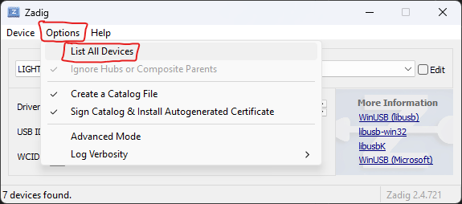

4. Note the current device list, then close Zadig.
5. Plug in the logic analyzer and reopen Zadig.
6. Compare the list and select the new device (for example, `Unknown Device #1`).

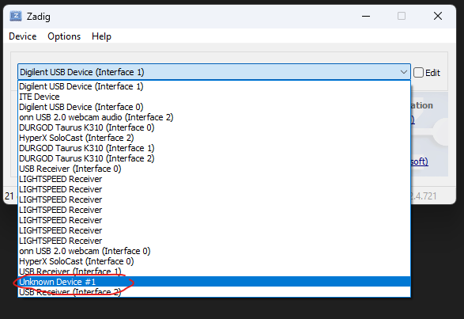

7. Verify you selected the correct device, then click **Install Driver**.

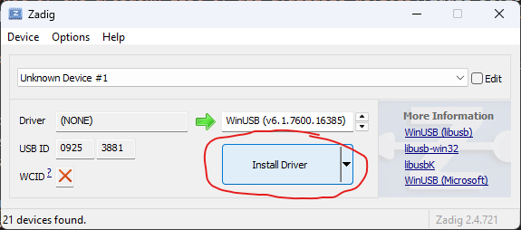

8. Wait for the install to complete. This can take longer than expected.

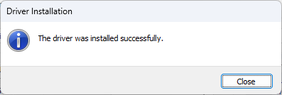

## 2. Connect the Analyzer in PulseView

1. Open **PulseView**.
2. If you see **Demo device**, your analyzer was not auto-detected yet.

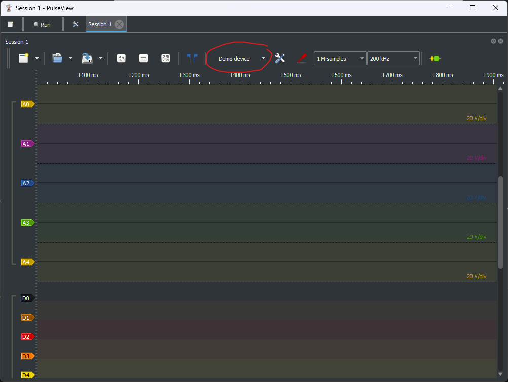

3. Open the device dropdown and click **Connect to Device**.

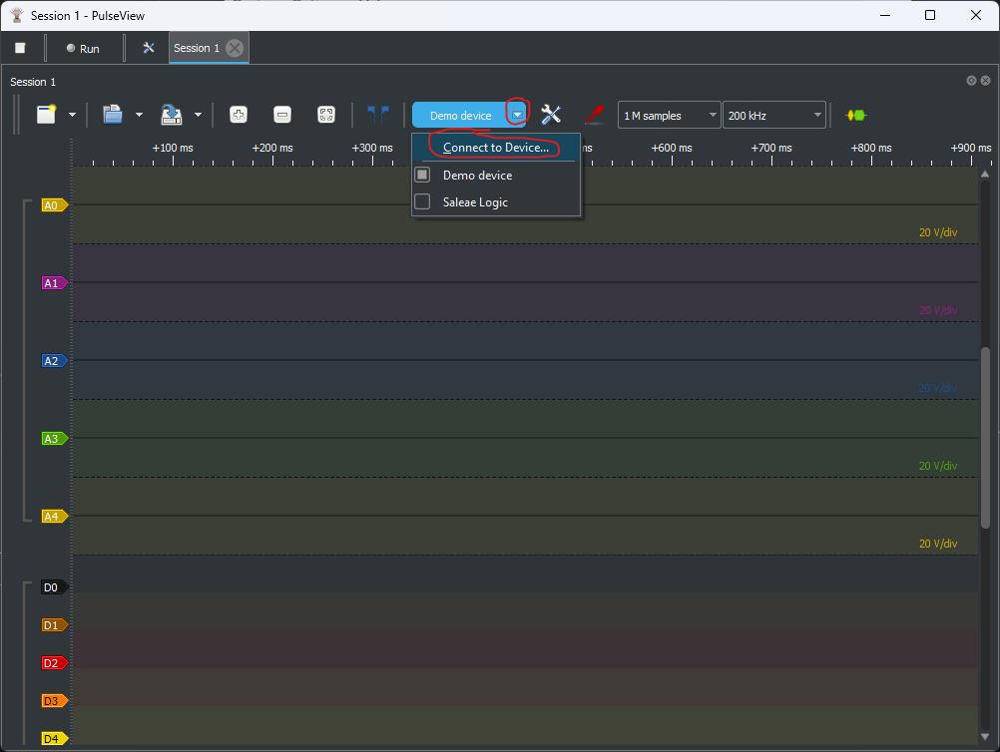

4. Choose the correct driver for your hardware.
   - The [SparkFun USB Logic Analyzer (24 MHz, 8-channel)](https://www.sparkfun.com/usb-logic-analyzer-24mhz-8-channel.html) uses `fx2lafw`.

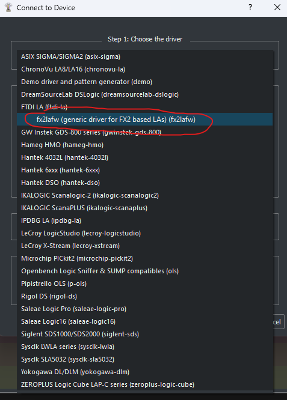

5. Click **Scan for devices using driver above**.

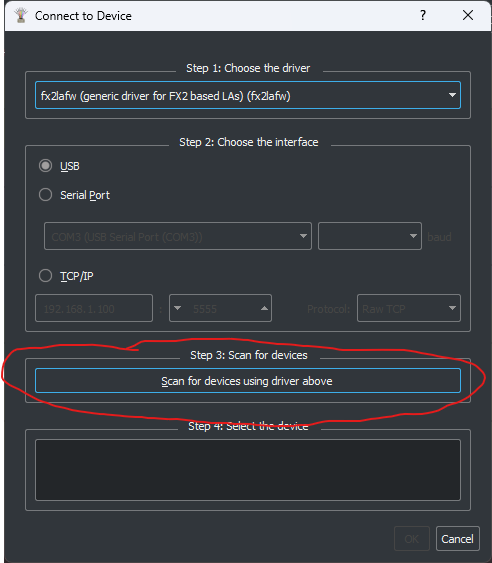

6. Select your analyzer from the scan results and click **OK**.

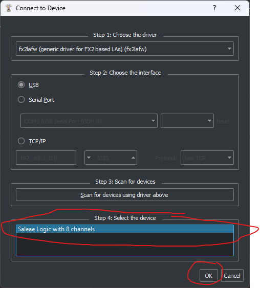

Your analyzer is now ready to capture signals.

## 3. Configure I2C Decoding

1. Set sample configuration first.
   - Recommended starting point: `10 MHz` sample rate for standard I2C debugging.
   - Increase sample rate if you are analyzing faster buses.

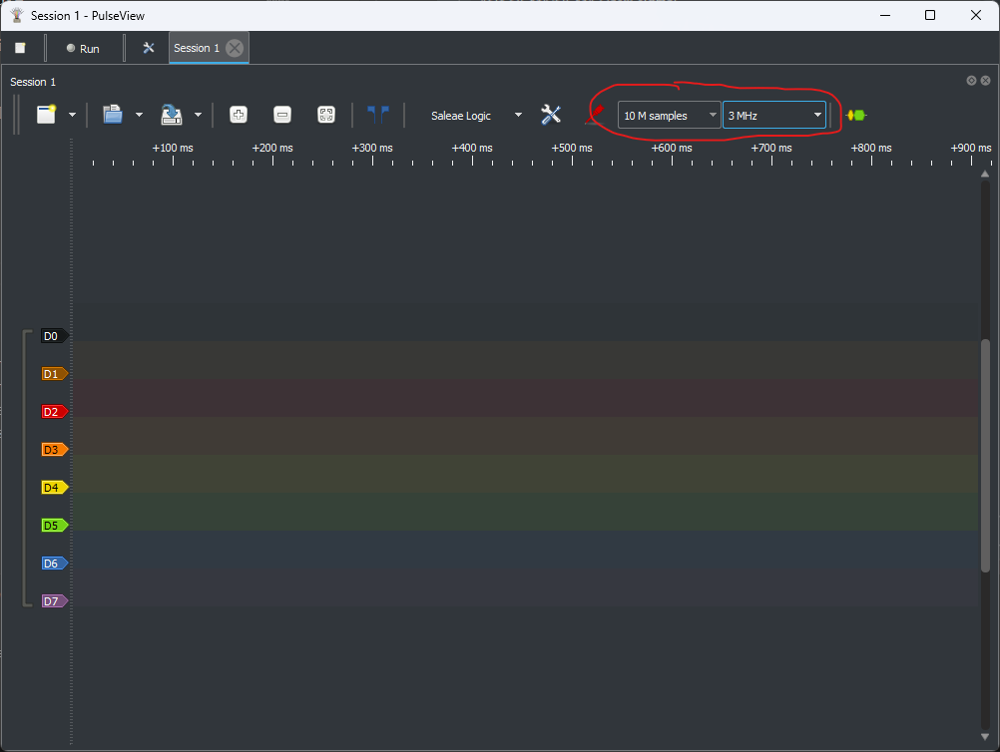

2. Click **Add Protocol Decoder**.

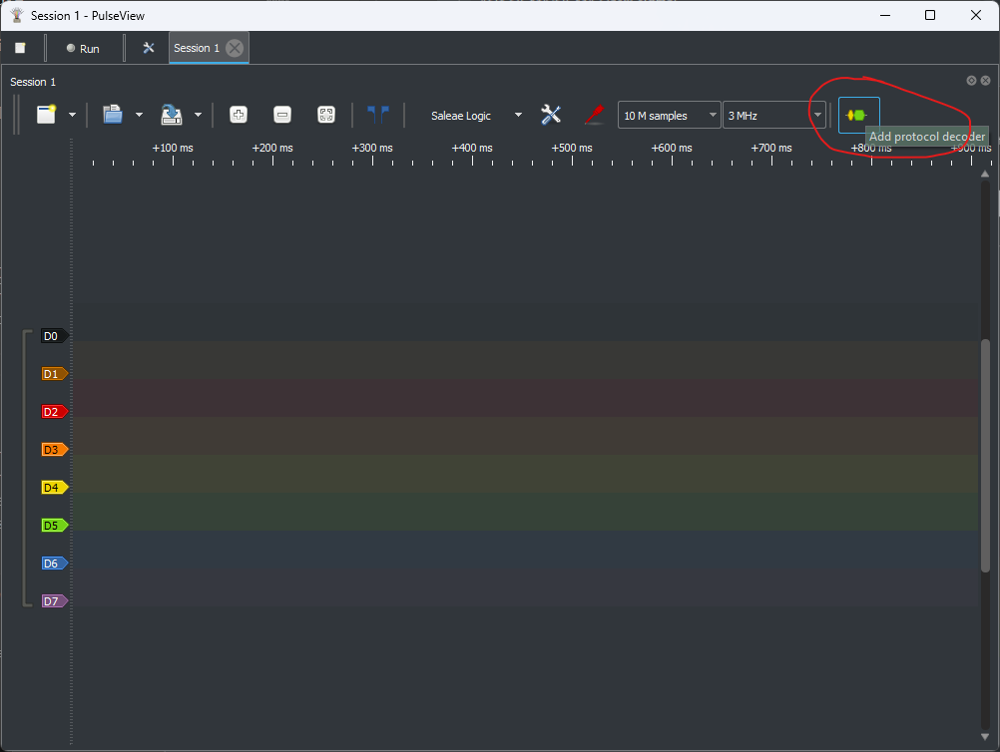

3. Search for `I2C` and double-click it.

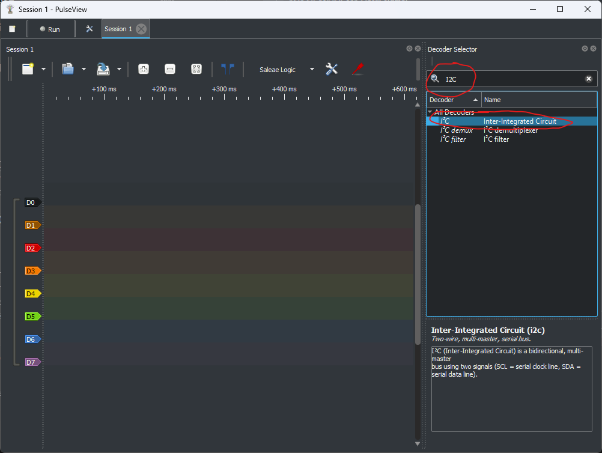

4. Confirm the I2C decoder appears in the channel list.

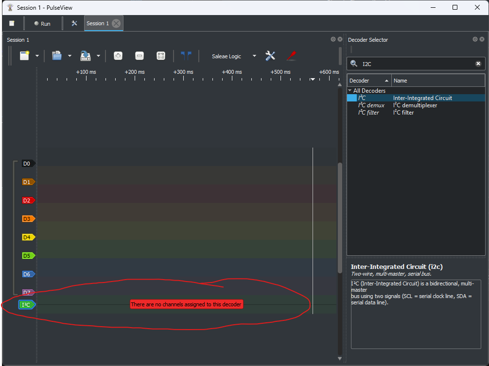

5. Configure channel mapping:
   - `SDA` -> data line
   - `SCL` -> clock line
   - Optional: set colors for readability

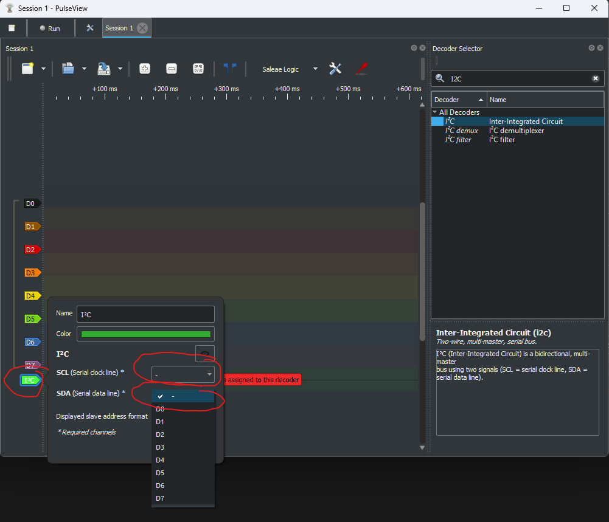

## FAQ

### PulseView cannot find my analyzer after unplugging/replugging

1. Unplug and reconnect the analyzer.
2. Re-run the PulseView **Connect to Device** scan.
3. If still missing, reinstall the Zadig driver for that device.
4. Device names can change after reconnecting (for example, channel count display may differ).

## Sources
[Logic Analyzer Used In Guide](https://www.sparkfun.com/usb-logic-analyzer-24mhz-8-channel.html)
[Setting Up Logic Analyzer With Pulseview Guide](https://learn.sparkfun.com/tutorials/using-the-usb-logic-analyzer-with-sigrok-pulseview)
